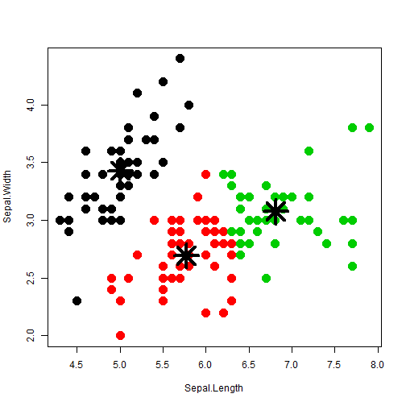

Course Project: Shiny Application and Reproducible Pitch
========================================================
author: Erik Zsáki
date:   2017-01-29
autosize: true


Overview
========================================================

This was built for the course Developing Data Products as part of the Coursera Data Science Specialization.

The shiny app developed for this assignment is avalilable at: https://zsakierik.shinyapps.io/Course_Project/

The source codes of ui.R and server.R and also Rpresentation are available on the GitHub repo: https://github.com/zsakierik/DevelopingDataProducts/tree/master/Course_Project


Iris Dataset
========================================================

```
  Petal.Length Petal.Width Species
1          1.4         0.2  setosa
2          1.4         0.2  setosa
3          1.3         0.2  setosa
4          1.5         0.2  setosa
5          1.4         0.2  setosa
6          1.7         0.4  setosa
```
This famous (Fisher's or Anderson's) iris data set gives the measurements in centimeters of the variables sepal length and width and petal length and width. 

Iris is a data frame with 
- 150 cases (rows)  
- 5 variables (columns) 


Cluster Plot
========================================================

```r
irisCluster <- kmeans(iris[,1:2], 3)
plot(iris[,1:2], col = irisCluster$cluster, pch = 20, cex = 3)
      points(irisCluster$centers, pch = 8, cex = 4, lwd = 4)
```



Web Application functionality
========================================================
The application: https://zsakierik.shinyapps.io/Course_Project/
- Choose cluster number
- Choose X and Y dimension
- Choose method(k-means clustering or k-medoids clustering)

